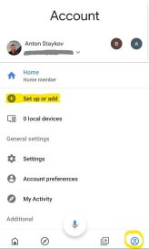
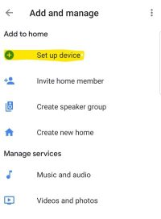
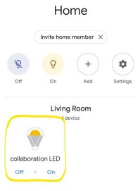

# Azure AD B2C and Google SmartHome actions
## Background
Let's say you are building a custom action for Google's smart home or Google Assitant. In some cases you need to add authentication
to your custom action. General guidance on how to do that is provided by Google here. However, there are some missing part of that documentation, and of course there are no specific provider guidances.

In this short guidance we will describe all neccessary steps needed to add Azure AD B2C as authentication provider for your Google Custom Action.

## Azure AD B2C Setup
First of all, when designing smart home solutions it is important to note that our solution has multiple identity integration services.
From one side this is our back-end API. One of the most effective ways of designing solution which will have multiple 
integrations is to isolate back-ends from front-ends. 
Especially when front-ends might be smart assistants like Google Assistant, Alexa or Cortana. 

### The back-end resource server (API)
We will register our back-end API as a single application in Azure AD B2C. Then we will expose some custom scopes. 
The registration will be as simple as giving our application a name and an URL (it does not really matter, because 
this is a Web API and will never use interacitve login flows). We mark the application as `Web Application / Web API` 
and do not enable implicit flow nor native client:

Next, we define couple of additional scopes (next to the default `user_impersonation`) that this API exposes:

  * iot_admin
  * iot_control
  * iot_read

This is all we need to do for our back-end API registration. Of course, to have a meaningful application we have to actually develop our API and protect it using a simple Bearer Token authentication.

A complete sample of how to protect ASP.NET Core Web API using Bearer Authentication middleware can be found [here](https://github.com/Azure-Samples/active-directory-b2c-dotnetcore-webapi)

> At this point you may want to also implement a MVP (Minimal Viable Product) that can act as your resource server.
> Luckily, I have prepared [a very simple code](./azure-function/index.js) which you can deploy as Azure Function. 
> This code simulates a smart lamp (LED) device. In order to work, you have to configure your function app to be 
> protected by the Azure AD B2C policy you use to authenticate users. A guide how to configure Azure Function with 
> Azure AD B2C Authentication can be found [here](https://blogs.msdn.microsoft.com/hmahrt/2017/03/07/azure-active-directory-b2c-and-azure-functions/).

### A sign-up or sign-in user flow
Another important piece of configuration we need to complete is to create a [sign-up or sign-in user flow](https://docs.microsoft.com/en-us/azure/active-directory-b2c/active-directory-b2c-reference-policies) to use with Google Actions.
This can be any simple sign-up or sign-in user flow as [described here](https://docs.microsoft.com/en-us/azure/active-directory-b2c/tutorial-create-user-flows). 

After we the create the flow, we not the endpoints for our flow. They are as follows:

Authorization endpoint:

 > https://`your-tenant-name`.b2clogin.com/`your-tenant-name`.onmicrosoft.com/`user-flow-id`/oauth2/v2.0/authorize

 Token endpoint:

  > https://`your-tenant-name`.b2clogin.com/`your-tenant-name`.onmicrosoft.com/`user-flow-id`/oauth2/v2.0/token

We note these URLs down as we will need them later when you configure account linking in our Custom Action.

## Google Custom Action Front End
As we do not control the front end where our end users will be 
actually authenticating (this will be their Android Device), it is 
good practice to register Google as a separate front end for our 
Smart Home solution.

This will be again a `Web App / Web API` registration. We will not enable implicit flow. 
And we will not enable native client. 
That is, because the Google assistant actually uses a web-front end 
and `confidential client` to authorize the end user. 
Sample application registration for the Google front-end looks like that:

Please note the `Reply URL` for our front end. It has a special value. 
Where do we get that value from will be described in the following sections.

We need to configure one very important aspect. Namely the access to our back-end. 
This we do from the `API Access` section. We click on the `Add` button and 
browse / search for our back-end API registered application. 
Then we choose appropriate scopes to grant access:

The last thing we will need from this application registration, is
an application secret. To generate one, navigate to the `Keys` section,
click on `Generate Key` and finally save the application to view that key:

 > Copy and paste that key immediately, as you will never have the option to see it again!

## Google Custom Action configuration
Google has relatively good described how to build [custom smarthome action here](https://developers.google.com/actions/smarthome/). 
A complete [step-by-step tutorial to create your smarthome action is located here](https://developers.google.com/actions/smarthome/develop/create). 
The second step of this tutorial is requirement for OAuth2 Server - we have Azure AD B2C to serve that purpose. One thing though, which is not explained in this tutorial, is what shall be the Reply URL registered with the OAuth server. This information is well described in the [account linking section](https://developers.google.com/actions/identity/oauth2?oauth=code):

The Reply URL when you register OAuth 2 client shall have the format: 
 > https://oauth-redirect.googleusercontent.com/r/`YOUR_PROJECT_ID`

You get the project id from your Google project settings.

At this point we have to go back to Azure AD B2C and update our **front-end** application registration with the respective `Reply URL`.

### Properly configure account linking for work with Azure AD B2C
As we pointed, there is a complete [step-by-step tutorial to create your smarthome action is located here](https://developers.google.com/actions/smarthome/develop/create). 
One thing, though, that we have to pay attention to is the account linking configuration. The marked as `optional` client configuration is not optional at all when it comes to Azure AD B2C. 
There we have to include the scopes for which Google Assitant shall get authorization from the end-user and obtain access and refresh tokens respectively to call our back end APIs.

Having all the info we need from Azure AD B2C we proceed with configuring account linking:

Fill out the respective values as follows:

 * Client ID - the client id (application id) of your front end application registration in Azure AD B2C
 * Client secret - the generated client secret for the front end application
 * Authorization URL - the authorization url for your sign-up or sign-in flow
 * Token URL - the token url for your sign-up or sign-in flow

 > !Important: The authorization and token URL must refer to the same user flow! Otherwise your account linking will not work

Next step is complete the optional client configuration, which is very important for Azure AD B2C.
We have to add all the scopes that will be inlcuded in the authorization request. There are:

 * openid - to get basic user profile information
 * offline_access - this is very important. Only when we include the `offline_access` scope, Azure AD B2C will issue a `refresh_token` along with the `access_token`. And this is crucial for the proper account linking
 * any other addition scope for the backend API with their full FQDN. Similar to `https://snetga.onmicrosoft.com/smartcollabapi/iot_read`

A sample configuration looks like:

 

## Activate your custom action
As a last step towards testing is activating your custom action and actually performing account linking.
To do so you will need any android device where you are signed-in with the same Google account which you used to create the custom action project.

 1. Open your Google Home app and navigate to the profile (bottom right icon) and click on the `Set up or add` area
 

 2. Chose the `Setup device` option
 

 3. Next select the `Works with Google` option
 

 4. On the presented list of all `Works with Google` accounts look for a black and white cloud icon 
 with description similar to `[test] Your Project Name` and select it
 

 5. At this moment you must have been redirected to your Azure AD B2C flow. This can be seen on the very top of your screen. The sign-up / sign-in options that you configured in your user flow will be displayed 
 

 6. Once you complete the sign-in, Google Smart Home will search for devices
 If you used the sample code provided here, it will find `collaboration LED`. You can add this to a room in your home

 7. Finally, the discovered device will be displayed on your home page and you can controll it 
